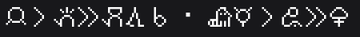

# Sitelen Pona Revenge Fonts 
Sitelen pona UCSUR fonts for Revenge, Kettu and other Vendetta forks

| Font | PUA Only\* | Preview | Link (Stable) | Link (Unstable) |
|---|---|---|---|---|
| nasin nanpa | ✅ |  | [link](https://raw.githubusercontent.com/Flatkat/sitelen-pona-revenge-fonts/refs/heads/main/font-snippets/nasin-nanpa.json) |[link](https://raw.githubusercontent.com/Flatkat/sitelen-pona-revenge-fonts/refs/heads/main/font-snippets/unstable/nasin-nanpa-unstable.json) |
| Fairfax | ❌ |  | [link](https://raw.githubusercontent.com/Flatkat/sitelen-pona-revenge-fonts/refs/heads/main/font-snippets/fairfax.json) | - |
| FairfaxHD | ❌ |  | [link](https://raw.githubusercontent.com/Flatkat/sitelen-pona-revenge-fonts/refs/heads/main/font-snippets/fairfax-hd.json) | - |
| sitelen seli kiwen juniko | ❌ |  | [link](https://raw.githubusercontent.com/Flatkat/sitelen-pona-revenge-fonts/refs/heads/main/font-snippets/sitelen-seli-kiwen-juniko.json) | - |

\*PUA only indicates wether the font only affects characters in the Unicode Private User Area (the range UCSUR work in) without also changing the appearance of ASCII characters and others